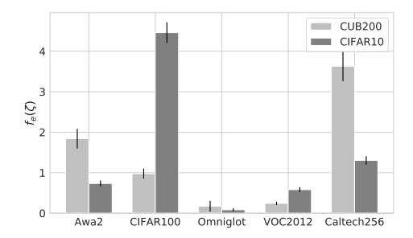
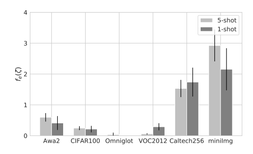

# TAEML (Few-shot Classificaiton)

### **CONTENT**
> TAEML: Task-Adaptive Ensemble of Meta-Leaners for Few-shot Classification

+ Minseop Park(AITRICS), Saehoon Kim (AITRICS), Jungtaek Kim (POSTECH), Yanbin Liu (UTS), Seungjin Choi(POSTECH)

<b> Update (December 12, 2018)</b> TensorFlow implementation of [TAEML: Task-Adaptive Ensemble of Meta-Learners for Few-Shot Classification](http://metalearning.ml/2018/papers/metalearn2018_paper22.pdf) which tackles the limitation of current meta-learning framework for few-shot classification, that the target tasks and the training tasks are sampled from the same task distribution. Our model efficiently solves this problem by training the model to putt the ensemble weights on the pre-trained meta-learners asscosiated with each task distribution.

## Abstract
Most of meta-learning methods assume that a set of tasks in the meta-training
phase is sampled from a single dataset. Thus, when a new task is drawn from
another dataset, the performance of meta-learning methods is degraded. To alleviate
this effect, we introduce a task-adaptive ensemble network that aggregates metalearners
by putting more weights on the learners that are expected to perform
well to the given task. Experiments demonstrate that our task-adaptive ensemble
significantly outperforms previous meta-learners and their uniform averaging.

## Getting Started
### Prerequisites

First, clone this repo in same directory.
```bash
$ git clone https://github.com/OpenXAIProject/TAEML.git
```
Then, you need to download some datasets for few-shot classification.

MNIST: http://yann.lecun.com/exdb/mnist/

CIFAR: https://www.cs.toronto.edu/~kriz/cifar.html

Caltech101 http://www.vision.caltech.edu/Image_Datasets/Caltech101/

Caltech256 http://www.vision.caltech.edu/Image_Datasets/Caltech256/

VOC2012  http://host.robots.ox.ac.uk/pascal/VOC/voc2012/

CUB-200 http://www.vision.caltech.edu/visipedia-data/CUB-200-2011/

Awa https://cvml.ist.ac.at/AwA2/


Preprocess the datasets to build a few-shot classification dataset
```bash
$ cd datasets-serializer
$ python read_datasets.py
$ python pkl2dataset.py
```
Then you get the datasets on the  directory. 


### Run the model
1. Pretrain all of the meta-learners
```bash
$ cd TAEML
$ ./pretrain_all.sh
```
2. train TAEML
```bash
$ python taeml_train.py
```
3. get the results
```bash
$ python get_results.py
```

### Results


<p float="left">
  
   
</p>


# XAI Project

### **Project Name**
> A machine learning and statistical inference framework for explainable artificial intelligence(의사결정 이유를 설명할 수 있는 인간 수준의 학습·추론 프레임워크 개발)
### **Managed by**
> Ministry of Science and ICT/XAIC
### **Participated Affiliation**
> UNIST, Korean Univ., Yonsei Univ., KAIST., AITRICS
### **Web Site**
> <http://openXai.org>
